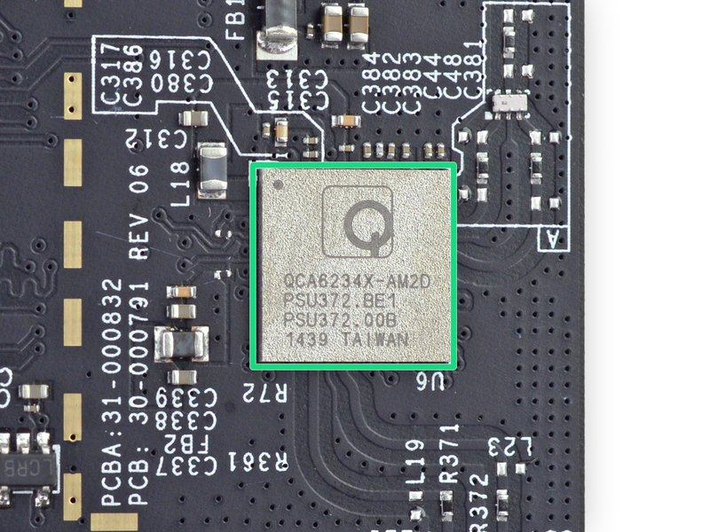

# Introduction to Machine Learning

## Overview

In computer science, the terms **Artificial Intelligence (AI)** and **Machine Learning (ML)** are often used interchangeably, leading to confusion. While closely related, they represent distinct concepts with specific applications and theoretical underpinnings.

---

## Artificial Intelligence (AI)

**Artificial Intelligence (AI)** is a broad field focused on developing intelligent systems capable of performing tasks that typically require human intelligence. These tasks include understanding natural language, recognizing objects, making decisions, solving problems, and learning from experience.

### Key Areas of AI

- **Natural Language Processing (NLP)**: Enabling computers to understand, interpret, and generate human language
- **Computer Vision**: Allowing computers to "see" and interpret images and videos
- **Robotics**: Developing robots that can perform tasks autonomously or with human guidance
- **Expert Systems**: Creating systems that mimic the decision-making abilities of human experts

### Goals of AI

One of the primary goals of AI is to **augment human capabilities**, not just replace human efforts. AI systems are designed to enhance human decision-making and productivity, providing support in complex data analysis, prediction, and mechanical tasks.

### Real-World Applications

AI solves complex problems across diverse domains:

- **Healthcare**: Improves disease diagnosis and drug discovery
- **Finance**: Detects fraudulent transactions and optimizes investment strategies
- **Cybersecurity**: Identifies and mitigates cyber threats

---

## Machine Learning (ML)

**Machine Learning (ML)** is a subfield of AI that focuses on enabling systems to learn from data and improve their performance on specific tasks without explicit programming. ML algorithms use statistical techniques to identify patterns, trends, and anomalies within datasets.

### Types of Machine Learning

#### 1. Supervised Learning
The algorithm learns from labeled data, where each data point is associated with a known outcome or label.

**Examples:**
- Image classification
- Spam detection
- Fraud prevention

#### 2. Unsupervised Learning
The algorithm learns from unlabeled data without providing an outcome or label.

**Examples:**
- Customer segmentation
- Anomaly detection
- Dimensionality reduction

#### 3. Reinforcement Learning
The algorithm learns through trial and error by interacting with an environment and receiving feedback as rewards or penalties.

**Examples:**
- Game playing
- Robotics
- Autonomous driving

### How ML Works

For instance, an ML algorithm can be trained on a dataset of images labeled as "cat" or "dog." By analyzing the features and patterns in these images, the algorithm learns to distinguish between cats and dogs. When presented with a new image, it can predict whether it depicts a cat or a dog based on its learned knowledge.

### ML Applications Across Industries

- **Healthcare**: Disease diagnosis, drug discovery, personalized medicine
- **Finance**: Fraud detection, risk assessment, algorithmic trading
- **Marketing**: Customer segmentation, targeted advertising, recommendation systems
- **Cybersecurity**: Threat detection, intrusion prevention, malware analysis
- **Transportation**: Traffic prediction, autonomous vehicles, route optimization

---

## Deep Learning (DL)

**Deep Learning (DL)** is a subfield of ML that uses neural networks with multiple layers to learn and extract features from complex data. These deep neural networks can automatically identify intricate patterns and representations within large datasets.

### Key Characteristics

1. **Hierarchical Feature Learning**: DL models learn hierarchical data representations, where each layer captures increasingly abstract features
   - Lower layers detect edges and textures in images
   - Higher layers identify complex structures like shapes and objects

2. **End-to-End Learning**: DL models can be trained end-to-end, directly mapping raw input data to desired outputs without manual feature engineering

3. **Scalability**: DL models scale well with large datasets and computational resources

### Common Neural Network Types

- **Convolutional Neural Networks (CNNs)**: Specialized for image and video data
- **Recurrent Neural Networks (RNNs)**: Designed for sequential data like text and speech
- **Transformers**: Particularly effective for NLP tasks using self-attention mechanisms

### DL Applications

DL has achieved state-of-the-art performance in:

- **Computer Vision**: Image classification, object detection, image segmentation
- **Natural Language Processing**: Sentiment analysis, machine translation, text generation
- **Speech Recognition**: Transcribing audio to text, speech synthesis
- **Reinforcement Learning**: Training agents for complex tasks

---

## The Relationship Between AI, ML, and DL

Machine Learning (ML) and Deep Learning (DL) are subfields of Artificial Intelligence (AI) that enable systems to learn from data and make intelligent decisions. They are crucial enablers of AI, providing the learning and adaptation capabilities that underpin many intelligent systems.

### How They Work Together

- **Computer Vision**: Supervised learning algorithms and Deep CNNs enable machines to "see" and interpret images accurately
- **Natural Language Processing**: Traditional ML algorithms and advanced DL models like transformers enable understanding and generating human language
- **Autonomous Driving**: A combination of ML and DL techniques processes sensor data, recognizes objects, and makes real-time decisions
- **Robotics**: Reinforcement learning algorithms, often enhanced with DL, train robots to perform complex tasks in dynamic environments

### The Synergy

ML and DL fuel AI's ability to learn, adapt, and evolve, driving progress across various domains and enhancing human capabilities. The synergy between these fields is essential for advancing the frontiers of AI and unlocking new levels of innovation and productivity.

---

## Key Takeaways

- **AI** is the broad field of creating intelligent systems
- **ML** is a subset of AI focused on learning from data
- **DL** is a subset of ML using deep neural networks
- Together, they enable systems to perform complex tasks and improve over time
- The relationship is hierarchical: AI ⊃ ML ⊃ DL

