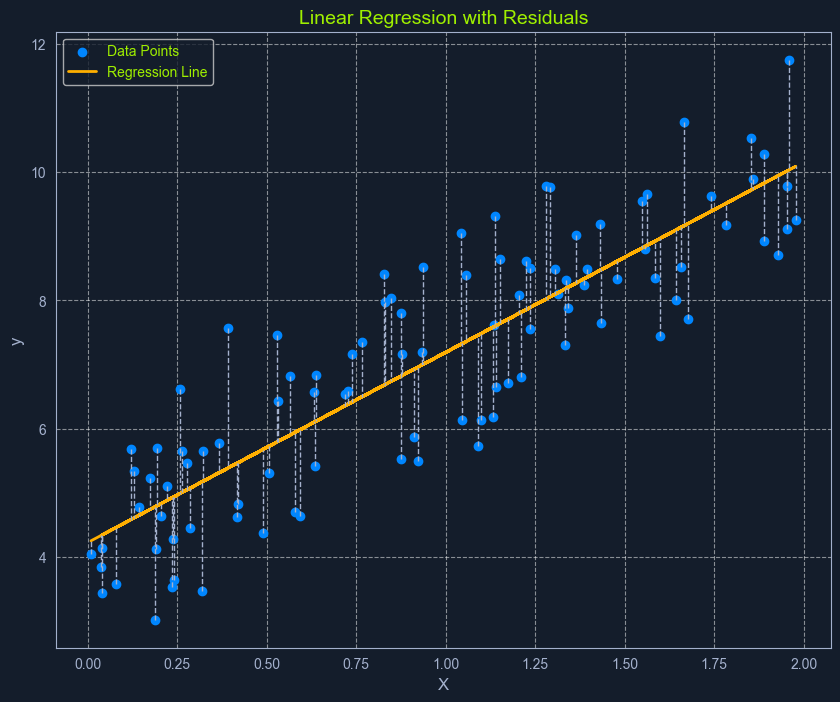

# Linear Regression

## Overview


*Scatter plot with data points and a linear regression line*

**Linear Regression** is a fundamental supervised learning algorithm that predicts a continuous target variable by establishing a linear relationship between the target and one or more predictor variables. The algorithm models this relationship using a linear equation, where changes in the predictor variables result in proportional changes in the target variable.

The goal is to find the best-fitting line that minimizes the sum of the squared differences between the predicted values and the actual values.

### Real-World Example

Imagine you're trying to predict a house's price based on its size. Linear regression would attempt to find a straight line that best captures the relationship between these two variables. As the size of the house increases, the price generally tends to increase. Linear regression quantifies this relationship, allowing us to predict the price of a house given its size.

---

## What is Regression?

Before diving into linear regression, it's essential to understand the broader concept of **regression** in machine learning. Regression analysis is a type of supervised learning where the goal is to predict a continuous target variable. This target variable can take on any value within a given range.

Think of it as estimating a number instead of classifying something into categories (which is what classification algorithms do).

### Examples of Regression Problems

- **Predicting house prices** based on size, location, and age
- **Forecasting daily temperature** based on historical weather data
- **Estimating website visitors** based on marketing spend and time of year

In all these cases, the output we're trying to predict is a **continuous value**. This is what distinguishes regression from classification, where the output is a categorical label (e.g., "spam" or "not spam").

Linear regression is simply one specific type of regression analysis where we assume a **linear relationship** between the predictor variables and the target variable. This means we try to model the relationship using a straight line.

---

## Simple Linear Regression

In its simplest form, **simple linear regression** involves one predictor variable and one target variable. A linear equation represents the relationship between them:

```python
y = mx + c
```

### Components

- **y**: The predicted target variable
- **x**: The predictor variable
- **m**: The slope of the line (representing the relationship between x and y)
- **c**: The y-intercept (the value of y when x is 0)

The algorithm aims to find the optimal values for **m** and **c** that minimize the error between the predicted y values and the actual y values in the training data. This is typically done using **Ordinary Least Squares (OLS)**, which aims to minimize the sum of squared errors.

---

## Multiple Linear Regression

When multiple predictor variables are involved, it's called **multiple linear regression**. The equation becomes:

```python
y = b0 + b1*x1 + b2*x2 + ... + bn*xn
```

### Components

- **y**: The predicted target variable
- **x1, x2, ..., xn**: The predictor variables
- **b0**: The y-intercept
- **b1, b2, ..., bn**: The coefficients representing the relationship between each predictor variable and the target variable

---

## Ordinary Least Squares (OLS)


*Scatter plot with data points, a linear regression line, and residuals*

**Ordinary Least Squares (OLS)** is a common method for estimating the optimal values for the coefficients in linear regression. It aims to minimize the sum of the squared differences between the actual values and the values predicted by the model.

Think of it as finding the line that minimizes the total area of the squares formed between the data points and the line. This "line of best fit" represents the relationship that best describes the data.

### The OLS Process

1. **Calculate Residuals**: For each data point, the residual is the difference between the actual y value and the y value predicted by the model

2. **Square the Residuals**: Each residual is squared to ensure that all values are positive and to give more weight to larger errors

3. **Sum the Squared Residuals**: All the squared residuals are summed to get a single value representing the model's overall error. This sum is called the **Residual Sum of Squares (RSS)**

4. **Minimize the Sum of Squared Residuals**: The algorithm adjusts the coefficients to find the values that result in the smallest possible RSS

This process can be visualized as finding the line that minimizes the total area of the squares formed between the data points and the line.

---

## Assumptions of Linear Regression

Linear regression relies on several key assumptions about the data:

### 1. Linearity
A linear relationship exists between the predictor and target variables. The relationship can be represented by a straight line.

### 2. Independence
The observations in the dataset are independent of each other. One observation does not influence another.

### 3. Homoscedasticity
The variance of the errors is constant across all levels of the predictor variables. This means the spread of the residuals should be roughly the same across the range of predicted values.

### 4. Normality
The errors are normally distributed. This assumption is important for making valid inferences about the model's coefficients.

---

## Important Considerations

⚠️ **Assessing these assumptions before applying linear regression ensures the model's validity and reliability.** If these assumptions are violated, the model's predictions may be inaccurate or misleading.

### Checking Assumptions

- **Linearity**: Plot the data and look for linear patterns
- **Independence**: Understand the data collection process
- **Homoscedasticity**: Plot residuals vs. fitted values
- **Normality**: Use Q-Q plots or statistical tests on residuals

---

## Summary

Linear regression is a powerful yet simple algorithm for predicting continuous values:

- **Simple Linear Regression**: One predictor variable → One target variable
- **Multiple Linear Regression**: Multiple predictor variables → One target variable
- **OLS Method**: Finds the line that minimizes squared errors
- **Key Assumptions**: Linearity, Independence, Homoscedasticity, Normality

Linear regression serves as the foundation for many more complex regression techniques and is widely used in data science and machine learning applications.

