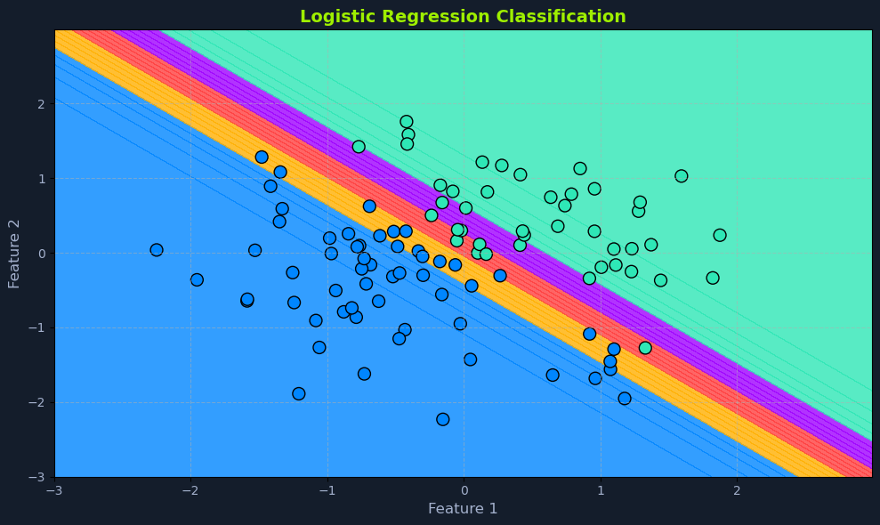
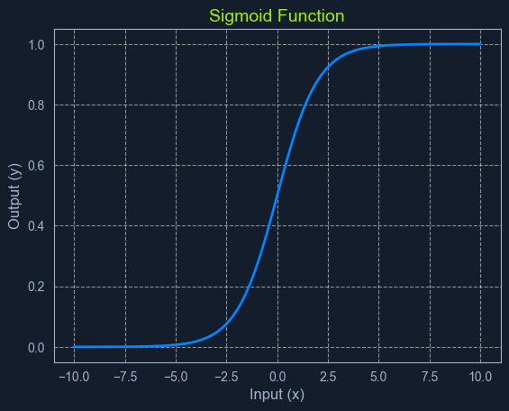
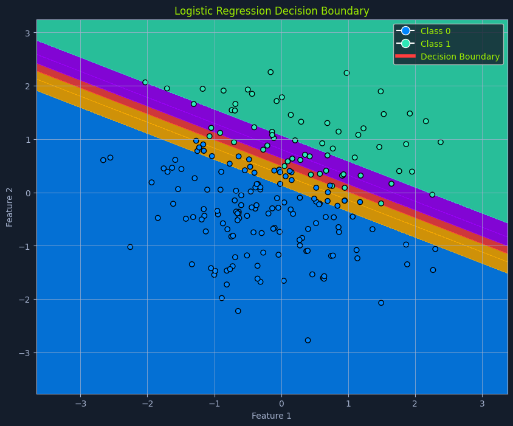
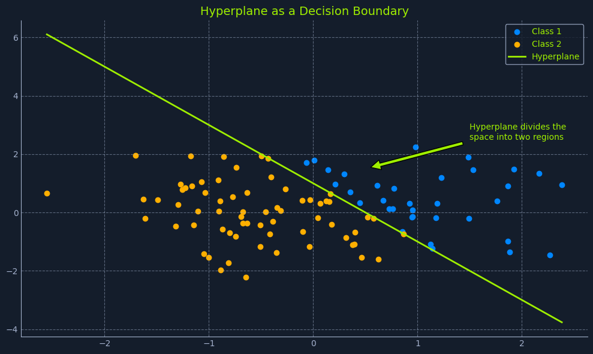

# Logistic Regression

## Overview


*Scatter plot with logistic regression classification, showing data points and decision boundary with color-coded regions*

Despite its name, **logistic regression** is a supervised learning algorithm primarily used for **classification**, not regression. It predicts a categorical target variable with two possible outcomes (binary classification). These outcomes are typically represented as binary values (e.g., 0 or 1, true or false, yes or no).

### Real-World Examples

Logistic regression can predict:
- Whether an email is spam or not
- Whether a customer will click on an ad
- Whether a transaction is fraudulent

The algorithm models the **probability** of the target variable belonging to a particular class using a **logistic function**, which maps the input features to a value between 0 and 1.

---

## What is Classification?

Before we delve deeper into logistic regression, let's clarify what **classification** means in machine learning. Classification is a type of supervised learning that aims to assign data points to specific categories or classes.

**Unlike regression, which predicts a continuous value, classification predicts a discrete label.**

### Examples of Classification Problems

- **Identifying fraudulent transactions** (fraudulent or not fraudulent)
- **Classifying images of animals** (cat, dog, bird, etc.)
- **Diagnosing diseases based on patient symptoms** (disease present or not present)

In all these cases, the output we're trying to predict is a **category or class label**.

---

## How Logistic Regression Works

Unlike linear regression, which outputs a continuous value, logistic regression outputs a **probability score between 0 and 1**. This score represents the likelihood of the input belonging to the positive class (typically denoted as '1').

It achieves this by employing a **sigmoid function**, which maps any input value (a linear combination of features) to a value within the 0 to 1 range. This function introduces non-linearity, allowing the model to capture complex relationships between the features and the probability of the outcome.

---

## What is a Sigmoid Function?


*Graph of sigmoid function showing an S-shaped curve with input (x) on the horizontal axis and output (y) on the vertical axis*

The **sigmoid function** is a mathematical function that takes any input value (ranging from negative to positive infinity) and maps it to an output value between 0 and 1. This makes it particularly useful for modeling probabilities.

### Characteristics

The sigmoid function has a characteristic **"S" shape**, hence its name:
- It starts with low values for negative inputs
- It rapidly increases around zero
- It plateaus at high values for positive inputs

This smooth, gradual transition between 0 and 1 allows it to represent the probability of an event occurring.

### Role in Logistic Regression

In logistic regression, the sigmoid function transforms the linear combination of input features into a probability score. This score represents the likelihood of the input belonging to the positive class.

---

## The Sigmoid Function

The sigmoid function's mathematical representation is:

```python
P(x) = 1 / (1 + e^-z)
```

### Components

- **P(x)**: The predicted probability
- **e**: The base of the natural logarithm (approximately 2.718)
- **z**: The linear combination of input features and their weights, similar to the linear regression equation:
  - `z = m1*x1 + m2*x2 + ... + mn*xn + c`

---

## Spam Detection Example



Let's say we're building a spam filter using logistic regression. The algorithm would:

1. **Analyze various email features**:
   - Sender's address
   - Presence of certain keywords
   - Email content

2. **Calculate a probability score**

3. **Make a classification decision**: If the score exceeds a predefined threshold (e.g., 0.8), the email will be classified as spam

---

## Decision Boundary


*Scatter plot with logistic regression decision boundary, showing data points classified as Class 0 and Class 1*

A crucial aspect of logistic regression is the **decision boundary**.

### 2D Visualization

In a simplified scenario with two features, imagine a line separating the data points into two classes. This separator is the decision boundary, determined by the model's learned parameters and the chosen threshold probability.

### Higher Dimensions

In higher dimensions with more features, this separator becomes a **hyperplane**. The decision boundary defines the cutoff point for classifying an instance into one class or another.

---

## Understanding Hyperplanes


*Scatter plot with hyperplane dividing Class 1 and Class 2 data points*

In the context of machine learning, a **hyperplane** is a subspace whose dimension is one less than that of the ambient space. It's a way to visualize a decision boundary in higher dimensions.

### Dimensional Perspective

Think of it this way:

- **2-dimensional space** (like a sheet of paper): A hyperplane is simply a **line** that divides the space into two regions

- **3-dimensional space** (like your room): A hyperplane is a **flat plane** that divides the space into two halves

- **Higher dimensions** (with more than three features): Difficult to visualize, but the concept remains the same. A hyperplane is a "flat" subspace that divides the higher-dimensional space into two regions

### Role in Logistic Regression

In logistic regression, the hyperplane is defined by:
- The model's learned parameters (coefficients)
- The chosen threshold probability

It acts as the **decision boundary**, separating data points into classes based on their predicted probabilities.

---

## Threshold Probability

The threshold probability is often set at **0.5** but can be adjusted depending on the specific problem and the desired balance between true and false positives.

### Classification Rules

- **If P(x) > threshold**: The instance is classified as the **positive class**
- **If P(x) < threshold**: The instance is classified as the **negative class**

### Example

In spam detection:
- If the model predicts an email has a **0.8 probability** of being spam (and the threshold is 0.5), it's classified as spam
- Adjusting the threshold to **0.6** would require a higher probability for the email to be classified as spam

---

## Data Assumptions

While not as strict as linear regression, logistic regression does have some underlying assumptions about the data:

### 1. Binary Outcome
The target variable must be categorical, with only **two possible outcomes**.

### 2. Linearity of Log Odds
It assumes a linear relationship between the predictor variables and the **log-odds** of the outcome.

**Log odds** are a transformation of probability, representing the logarithm of the odds ratio (the probability of an event occurring divided by the probability of it not occurring).

### 3. No or Little Multicollinearity
Ideally, there should be little to no multicollinearity among the predictor variables.

**Multicollinearity** occurs when predictor variables are highly correlated, making it difficult to determine their individual effects on the outcome.

### 4. Large Sample Size
Logistic regression performs better with **larger datasets**, allowing for more reliable parameter estimation.

---

## Validating Assumptions

⚠️ **Assessing these assumptions before applying logistic regression helps ensure the model's accuracy and reliability.**

### Techniques for Evaluation

- **Data exploration**: Examine the structure and characteristics of your data
- **Visualization**: Create plots to understand relationships and distributions
- **Statistical tests**: Use formal tests to evaluate assumptions (e.g., VIF for multicollinearity)

---

## Summary

Logistic regression is a powerful classification algorithm that:

- **Predicts probabilities** between 0 and 1 using the sigmoid function
- **Creates decision boundaries** to separate classes
- **Works best for binary classification** problems
- **Requires specific data assumptions** to be met

Key concepts:
- **Sigmoid function**: Maps linear combinations to probabilities
- **Decision boundary**: Separates classes in feature space
- **Hyperplane**: Higher-dimensional decision boundary
- **Threshold**: Determines classification cutoff point

Despite its name containing "regression," logistic regression is fundamentally a classification algorithm that provides probabilistic predictions.
