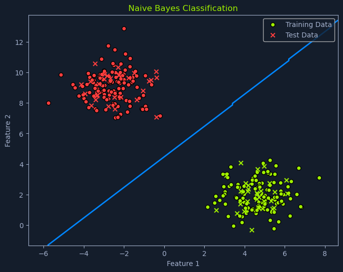

# Naive Bayes

## Overview


*Scatter plot showing Naive Bayes classification with training data in green and test data in red, separated by a decision boundary*

**Naive Bayes** is a probabilistic algorithm used for classification tasks. It's based on **Bayes' theorem**, a fundamental concept in probability theory that describes the probability of an event based on prior knowledge and observed evidence.

Naive Bayes is a popular choice for tasks like:
- Spam filtering
- Sentiment analysis
- Document classification

This is due to its simplicity, efficiency, and surprisingly good performance in many real-world scenarios.

---

## Bayes' Theorem

Before diving into Naive Bayes, let's understand its core concept: **Bayes' theorem**. This theorem provides a way to update our beliefs about an event based on new evidence. It allows us to calculate the probability of an event, given that another event has already occurred.

### Formula

It's mathematically represented as:

```python
P(A|B) = [P(B|A) * P(A)] / P(B)
```

### Components

**Where:**
- **P(A|B)**: The **posterior probability** of event A happening, given that event B has already happened
- **P(B|A)**: The **likelihood** of event B happening given that event A has already happened
- **P(A)**: The **prior probability** of event A happening
- **P(B)**: The **prior probability** of event B happening

---

## Medical Testing Example

Let's say we want to know the probability of someone having a disease (A) given that they tested positive for it (B). Bayes' theorem allows us to calculate this probability using:
- The prior probability of having the disease P(A)
- The likelihood of testing positive given that the person has the disease P(B|A)
- The overall probability of testing positive P(B)

### Given Information

Suppose we have the following information:

1. The prevalence of the disease in the population is **1%**, so `P(A) = 0.01`
2. The test is **95% accurate**, meaning if someone has the disease, they will test positive 95% of the time, so `P(B|A) = 0.95`
3. The test has a **false positive rate of 5%**, meaning if someone does not have the disease, they will test positive 5% of the time

### Step 1: Calculate P(B)

The probability of testing positive, P(B), can be calculated using the **law of total probability**:

```python
P(B) = P(B|A) * P(A) + P(B|¬A) * P(¬A)
```

**Where:**
- **P(¬A)**: The probability of not having the disease = `1 - P(A) = 0.99`
- **P(B|¬A)**: The probability of testing positive given that the person does not have the disease (false positive rate) = `0.05`

Now, substitute the values:

```python
P(B) = (0.95 * 0.01) + (0.05 * 0.99)
     = 0.0095 + 0.0495
     = 0.059
```

### Step 2: Apply Bayes' Theorem

Next, we use Bayes' theorem to find P(A|B):

```python
P(A|B) = [P(B|A) * P(A)] / P(B)
       = (0.95 * 0.01) / 0.059
       = 0.0095 / 0.059
       ≈ 0.161
```

### Result

**So, the probability of someone having the disease, given that they tested positive, is approximately 16.1%.**

### Key Insight

This example demonstrates how Bayes' theorem can be used to update our beliefs about the likelihood of an event based on new evidence. In this case, even though the test is quite accurate (95%), the low prevalence of the disease (1%) means that a positive test result still has a relatively low probability of indicating the actual presence of the disease.

---

## How Naive Bayes Works

The **Naive Bayes classifier** leverages Bayes' theorem to predict the probability of a data point belonging to a particular class given its features. To do this, it makes the **"naive" assumption of conditional independence** among the features.

### The Naive Assumption

This means it assumes that the presence or absence of one feature doesn't affect the presence or absence of any other feature, given that we know the class label.

### The Process

Let's break down how this works in practice:

#### 1. Calculate Prior Probabilities
The algorithm first calculates the **prior probability** of each class. This is the probability of a data point belonging to a particular class before considering its features.

**Example:** In a spam detection scenario:
- Probability of an email being spam: `P(spam) = 0.2` (20%)
- Probability of it being not spam: `P(not spam) = 0.8` (80%)

#### 2. Calculate Likelihoods
Next, the algorithm calculates the **likelihood** of observing each feature given each class. This involves determining the probability of seeing a particular feature value given that the data point belongs to a specific class.

**Examples:**
- What's the likelihood of seeing the word "free" in an email given that it's spam?
- What's the likelihood of seeing the word "meeting" given that it's not spam?

#### 3. Apply Bayes' Theorem
For a new data point, the algorithm combines the prior probabilities and likelihoods using Bayes' theorem to calculate the **posterior probability** of the data point belonging to each class.

The posterior probability is the updated probability of an event (the data point belonging to a certain class) after considering new information (the observed features). This represents the revised belief about the class label after considering the observed features.

#### 4. Predict the Class
Finally, the algorithm assigns the data point to the class with the **highest posterior probability**.

### Performance Note

⚠️ While the assumption of feature independence is often violated in real-world data (words like "free" and "viagra" might indeed co-occur more often in spam), **Naive Bayes often performs surprisingly well in practice**.

---

## Types of Naive Bayes Classifiers

The specific implementation of Naive Bayes depends on the type of features and their assumed distribution:

### 1. Gaussian Naive Bayes

**Use Case:** When the features are continuous and assumed to follow a **Gaussian distribution** (a bell curve).

**Example:** Predicting whether a customer will purchase a product based on their age and income, assuming age and income are normally distributed.

**Feature Type:** Continuous numerical values

---

### 2. Multinomial Naive Bayes

**Use Case:** Suitable for **discrete features** and often used in text classification.

**Example:** In spam filtering, the frequency of words like "free" or "money" might be the features, and Multinomial Naive Bayes would model the probability of these words appearing in spam and non-spam emails.

**Feature Type:** Count-based features (e.g., word frequencies)

---

### 3. Bernoulli Naive Bayes

**Use Case:** Employed for **binary features**, where the feature is either present or absent.

**Example:** In document classification, a feature could be whether a specific word is present in the document. Bernoulli Naive Bayes would model the probability of this presence or absence for each class.

**Feature Type:** Binary (0/1, True/False, Present/Absent)

---

### Choosing the Right Type

The choice of which type of Naive Bayes to use depends on:
- The nature of the data
- The distribution of features
- The specific problem being addressed

---

## Data Assumptions

While Naive Bayes is relatively robust, it's helpful to be aware of some data assumptions:

### 1. Feature Independence
As discussed, the core assumption is that features are **conditionally independent given the class**. This is the "naive" part of Naive Bayes.

**Reality:** This assumption is often violated in real-world scenarios, but the algorithm still performs well in many cases.

### 2. Data Distribution
The choice of Naive Bayes classifier (Gaussian, Multinomial, Bernoulli) depends on the **assumed distribution of the features**.

**Importance:** Matching the classifier type to your data distribution improves performance.

### 3. Sufficient Training Data
Although Naive Bayes can work with limited data, it is important to have **sufficient data to estimate probabilities accurately**.

**Note:** Naive Bayes is actually one of the better-performing algorithms when training data is limited compared to more complex models.

---

## Advantages and Limitations

### ✅ Advantages

- **Fast and efficient** - Both training and prediction are quick
- **Works well with small datasets** - Requires less training data than many other algorithms
- **Handles high-dimensional data** - Performs well even with many features
- **Simple to implement** - Straightforward mathematical foundation
- **Performs well with categorical data** - Especially text classification
- **Probabilistic predictions** - Provides probability estimates for classifications

### ⚠️ Limitations

- **Naive independence assumption** - Features are rarely truly independent in practice
- **Zero probability problem** - If a feature value wasn't seen in training data, it gets zero probability (can be addressed with smoothing)
- **Not ideal for regression** - Primarily designed for classification tasks
- **Sensitive to feature distribution assumptions** - Incorrect distribution choice can hurt performance

---

## Summary

Naive Bayes is a powerful probabilistic classification algorithm that:

- **Uses Bayes' theorem** to calculate posterior probabilities
- Makes a **"naive" independence assumption** about features
- Comes in **three main types**: Gaussian, Multinomial, and Bernoulli
- Is **fast, efficient, and surprisingly effective** despite its simplifying assumptions
- Works particularly well for **text classification** and **spam filtering**

**Key Concepts:**
- **Prior Probability**: Probability before considering features
- **Likelihood**: Probability of features given a class
- **Posterior Probability**: Updated probability after considering features
- **Conditional Independence**: The naive assumption that features don't affect each other

Despite its simplicity and strong independence assumption, Naive Bayes remains a popular and effective algorithm for many classification tasks, particularly in natural language processing and text analysis.
