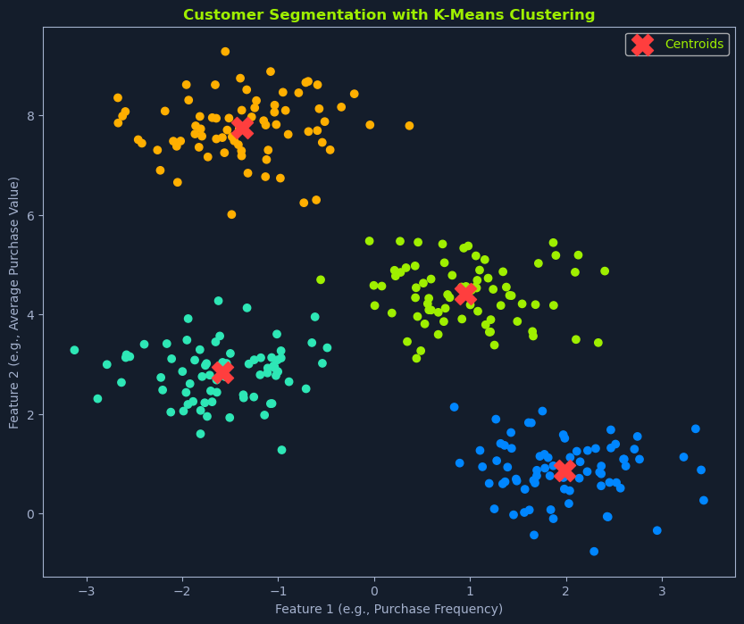
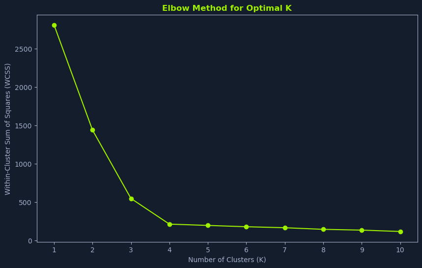
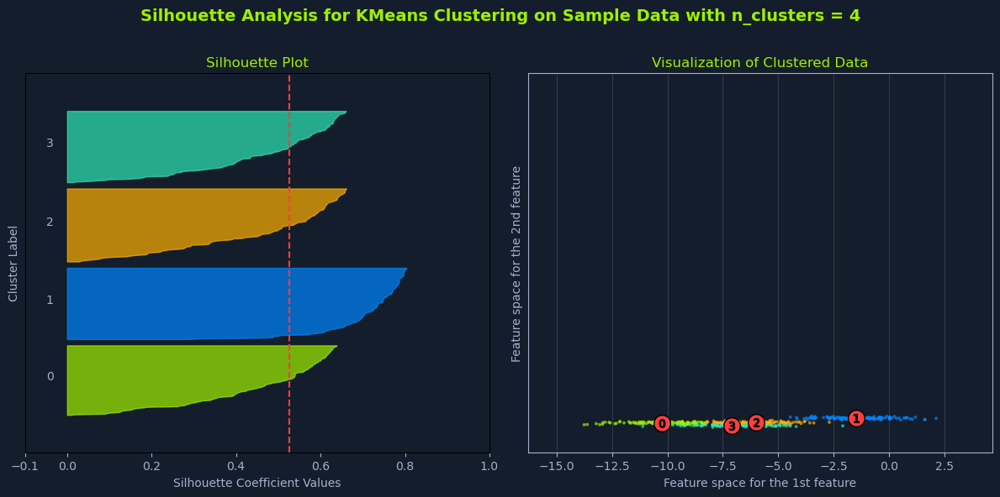

# K-Means Clustering

## Overview


*Scatter plot showing customer segmentation with K-Means clustering, featuring colored clusters and centroids*

**K-means clustering** is a popular unsupervised learning algorithm for partitioning a dataset into **K distinct, non-overlapping clusters**. The goal is to group similar data points, where similarity is typically measured by the distance between data points in a multi-dimensional space.

### Real-World Example

Imagine you have a dataset of customers with information about:
- Purchase history
- Demographics
- Browsing activity

K-means clustering can group these customers into distinct segments based on their similarities. This can be valuable for:
- Targeted marketing
- Personalized recommendations
- Customer relationship management

---

## How K-Means Works

K-means is an **iterative algorithm** that aims to minimize the variance within each cluster. This means it tries to group data points so that:
- Points within a cluster are as close to each other as possible
- Points are as far from data points in other clusters as possible

---

## The K-Means Algorithm

The algorithm follows these steps:

### Step 1: Initialization

**Randomly select K data points** from the dataset as the initial cluster centers (centroids).

**Centroids:** These represent the average point within each cluster.

**Note:** Different initialization methods can lead to different results (e.g., K-means++, which provides smarter initialization).

---

### Step 2: Assignment

**Assign each data point** to the nearest cluster center based on a distance metric, such as Euclidean distance.

**Process:**
- Calculate distance from each point to each centroid
- Assign point to the cluster with the nearest centroid

---

### Step 3: Update

**Recalculate the cluster centers** by taking the mean of all data points assigned to each cluster.

**Purpose:** This updates the centroid to better represent the center of the cluster.

**Formula for new centroid:**
```python
centroid_k = mean(all points in cluster k)
```

---

### Step 4: Iteration

**Repeat steps 2 and 3** until:
- The cluster centers no longer change significantly, OR
- A maximum number of iterations is reached

**Convergence:** This iterative process refines the clusters until they stabilize.

---

## Euclidean Distance

**Euclidean distance** is a common distance metric used to measure the similarity between data points in K-means clustering. It calculates the straight-line distance between two points in a multi-dimensional space.

### Formula

For two data points **x** and **y** with **n** features, the Euclidean distance is calculated as:

```python
d(x, y) = sqrt(Σ (xi - yi)²)
```

### Components

**Where:**
- **xi**: The value of the i-th feature for data point x
- **yi**: The value of the i-th feature for data point y
- **Σ**: Sum over all n features

### Example

For two points in 2D space:
- Point A: (2, 3)
- Point B: (5, 7)

```python
distance = sqrt((5-2)² + (7-3)²)
         = sqrt(9 + 16)
         = sqrt(25)
         = 5
```

---

## Choosing the Optimal K

Determining the **optimal number of clusters (K)** is crucial in K-means clustering. The choice of K significantly impacts:
- The clustering results
- Their interpretability

### The Challenge

- **Too few clusters**: Overly broad groupings
- **Too many clusters**: Overly granular and potentially meaningless clusters

⚠️ **Note:** There is no one-size-fits-all method for determining the optimal K. It often involves a combination of techniques and domain expertise.

---

## Elbow Method


*Line graph showing the Elbow Method for Optimal K with WCSS decreasing sharply at K=3*

The **Elbow Method** is a graphical technique that helps estimate the optimal K by visualizing the relationship between the number of clusters and the **within-cluster sum of squares (WCSS)**.

### Steps

#### 1. Run K-means for a range of K values
Perform K-means clustering for different values of K, typically starting from 1 and increasing incrementally (e.g., 1, 2, 3, 4, 5...).

#### 2. Calculate WCSS
For each value of K, calculate the WCSS.

**WCSS:** Measures the total variance within each cluster. Lower WCSS values indicate that the data points within clusters are more similar.

**Formula:**
```python
WCSS = Σ Σ ||x - centroid_k||²
```
(sum over all clusters k, sum over all points x in cluster k)

#### 3. Plot WCSS vs. K
Create a line graph with:
- **x-axis**: Number of clusters (K)
- **y-axis**: WCSS value

#### 4. Identify the Elbow Point
Look for the **"elbow" point** in the plot. This is where the WCSS starts to decrease at a slower rate.

**Interpretation:** This point often suggests a good value for K, indicating a balance between:
- Minimizing within-cluster variance
- Avoiding excessive granularity

### Understanding the Elbow

The elbow point represents a **trade-off between model complexity and model fit**:
- **Before the elbow**: Adding clusters significantly reduces WCSS
- **After the elbow**: Adding clusters provides diminishing returns
- **Beyond the elbow**: Might lead to overfitting, where the model captures noise rather than meaningful patterns

---

## Silhouette Analysis


*Silhouette plot and clustered data visualization for KMeans with 4 clusters, showing silhouette scores and cluster distribution*

**Silhouette analysis** provides a more quantitative approach to evaluating different values of K. It measures how similar a data point is to its own cluster compared to other clusters.

### Steps

#### 1. Run K-means for a range of K values
Similar to the elbow method, perform K-means clustering for different values of K.

#### 2. Calculate Silhouette Scores
For each data point, calculate its **silhouette score**.

**Silhouette Score Formula:**
```python
s(i) = (b(i) - a(i)) / max(a(i), b(i))
```

**Where:**
- **a(i)**: Average distance from point i to other points in the same cluster
- **b(i)**: Average distance from point i to points in the nearest neighboring cluster

### Interpreting Silhouette Scores

The silhouette score ranges from **-1 to 1**:

| Score Range | Interpretation |
|-------------|----------------|
| **Close to 1** | Data point is well-matched to its cluster and poorly matched to neighboring clusters (good) |
| **Close to 0** | Data point is on or very close to the decision boundary between two neighboring clusters (ambiguous) |
| **Close to -1** | Data point is probably assigned to the wrong cluster (bad) |

#### 3. Calculate Average Silhouette Score
For each value of K, calculate the **average silhouette score** across all data points.

**Formula:**
```python
avg_silhouette = mean(all silhouette scores)
```

#### 4. Choose K with the Highest Score
Select the value of K that yields the **highest average silhouette score**.

**Interpretation:** This indicates the clustering solution with the best-defined clusters.

### Benefits

Higher silhouette scores generally indicate better-defined clusters, where:
- Data points are more similar to their own cluster
- Data points are less similar to other clusters

---

## Domain Expertise and Other Considerations

While the elbow method and silhouette analysis provide valuable guidance, **domain expertise** is often crucial in choosing the optimal K.

### Context Matters

Consider:
- The specific context of the problem
- The desired level of granularity in the clusters
- Business or practical requirements

### Example

If the goal is to segment customers for targeted marketing, you might choose a K that aligns with:
- The number of distinct marketing campaigns you can realistically manage
- Budget constraints for different campaign types
- Available resources for personalized content creation

---

## Other Factors to Consider

### 1. Computational Cost
**Higher values of K** generally require more computational resources.

**Consideration:** Balance clustering quality with processing time and resource constraints.

---

### 2. Interpretability
The resulting clusters should be **meaningful and interpretable** in the context of the problem.

**Questions to ask:**
- Can you explain what each cluster represents?
- Do the clusters align with domain knowledge?
- Can stakeholders understand and act on the clusters?

---

### 3. Stability
Run K-means multiple times with different initializations:
- Do you get consistent results?
- If results vary significantly, the clustering might not be stable

---

### 4. Cluster Size Balance
Consider whether clusters have similar sizes:
- Very unbalanced clusters might indicate issues
- One large cluster with many small ones might suggest K is too high

---

## Data Assumptions

K-means clustering makes certain assumptions about the data:

### 1. Cluster Shape
**Assumption:** Clusters are spherical and have similar sizes.

**Implication:** K-means might not perform well if:
- Clusters have complex shapes (elongated, curved, etc.)
- Clusters vary significantly in size
- Clusters have different densities

**Solution:** Consider other clustering algorithms like DBSCAN or hierarchical clustering for non-spherical clusters.

---

### 2. Feature Scale
**Sensitivity:** K-means is sensitive to the scale of the features.

**Issue:** Features with larger scales can have a greater influence on the clustering results.

**Solution:** It's important to **standardize or normalize the data** before applying K-means.

**Example:**
- Feature 1: Income (range 20,000 - 200,000)
- Feature 2: Age (range 18 - 80)

Without scaling, income would dominate distance calculations.

---

### 3. Outliers
**Sensitivity:** K-means can be sensitive to outliers—data points that deviate significantly from the norm.

**Impact:** Outliers can:
- Distort the cluster centers
- Affect the clustering results
- Create clusters around themselves

**Solutions:**
- Remove outliers before clustering
- Use robust variants like K-medoids
- Apply outlier detection first

---

## Advantages and Limitations

### ✅ Advantages

- **Simple to understand and implement** - Intuitive algorithm with clear steps
- **Computationally efficient** - Works well with large datasets
- **Scales well** - Can handle high-dimensional data
- **Guaranteed convergence** - Will always converge to a solution
- **Works well for spherical clusters** - Effective when assumptions are met

### ⚠️ Limitations

- **Requires specifying K in advance** - Need to know number of clusters
- **Sensitive to initialization** - Different starting points can yield different results
- **Assumes spherical clusters** - Struggles with complex cluster shapes
- **Sensitive to outliers** - Outliers can distort results
- **Requires feature scaling** - Unscaled features can dominate
- **Local optima** - May converge to suboptimal solutions
- **Fixed number of clusters** - Cannot automatically determine K

---

## Summary

K-means clustering is a powerful unsupervised learning algorithm for partitioning data into distinct groups:

**Core Concept:**
- Partition data into K clusters by minimizing within-cluster variance
- Uses iterative assignment and update steps
- Measures similarity using distance metrics (typically Euclidean)

**Key Steps:**
1. **Initialize**: Select K initial centroids
2. **Assign**: Assign points to nearest centroid
3. **Update**: Recalculate centroids
4. **Iterate**: Repeat until convergence

**Choosing K:**
- **Elbow Method**: Look for the "elbow" in WCSS plot
- **Silhouette Analysis**: Choose K with highest average silhouette score
- **Domain Expertise**: Consider practical and business constraints

**Critical Assumptions:**
- Spherical cluster shapes
- Similar cluster sizes
- Scaled features
- Limited outliers

**Best Practices:**
- Always scale/normalize features before clustering
- Try multiple K values and compare results
- Run multiple times with different initializations
- Validate results with domain expertise
- Consider alternative algorithms if assumptions are violated

By combining quantitative methods (elbow method, silhouette analysis) with domain expertise and practical considerations, you can effectively apply K-means clustering to yield meaningful and insightful results for customer segmentation, pattern recognition, and data exploration tasks.
