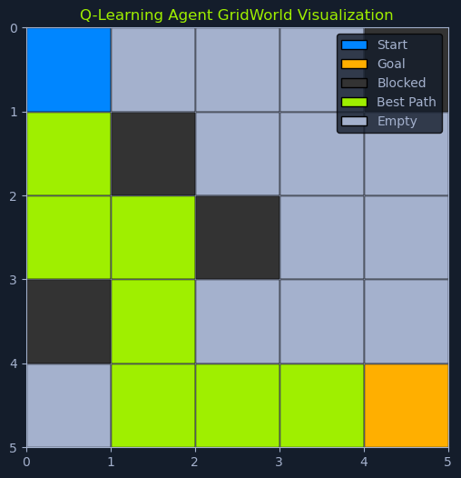

# Q-Learning

## Overview

**Q-learning** is a model-free reinforcement learning algorithm that learns an optimal policy by estimating the **Q-value**. The Q-value represents the expected cumulative reward an agent can obtain by taking a specific action in a given state and following the optimal policy afterward.

### Model-Free Approach

It's called **"model-free"** because:
- The agent doesn't need a prior model of the environment to learn
- It learns directly through trial and error
- It interacts with the environment and observes the outcomes
- No need to understand environment dynamics beforehand

---

## Self-Driving Car Example

Imagine a **self-driving car learning to navigate a city**:

### Initial State
- Starts without knowing the roads
- No knowledge of traffic lights
- Unfamiliar with pedestrian crossings
- No map or rules

### Learning Process

Through Q-learning, the car:

1. **Explores the city**: Tries different routes and actions

2. **Takes actions**: 
   - Accelerating
   - Braking
   - Turning left/right
   - Changing lanes

3. **Receives feedback**:
   - **Rewards**: For reaching destinations quickly and safely
   - **Penalties**: For collisions or traffic violations

4. **Learns optimal behavior**: Over time, learns which actions lead to higher rewards in different situations

### Result

Eventually, the car **masters the art of driving** in that city by learning from experience.

---

## The Q-Table

At the heart of Q-learning lies the **Q-table**. This table is a core component of the algorithm, storing the Q-values for all possible state-action pairs.

### Concept

Think of it as a **lookup table** that guides the agent's decision-making process:

- **Rows**: Represent the states (e.g., different locations in the city for the self-driving car)
- **Columns**: Represent the actions (e.g., accelerate, brake, turn left, turn right)
- **Cells**: Hold the Q-value for taking a particular action in a particular state

---

## Example Q-Table

Below is an illustration of a simple Q-table for a **grid world environment** where a robot can move up, down, left, or right. The grid cells represent the states, and the actions are the possible movements.

| State/Action | Up | Down | Left | Right |
|--------------|-----|------|------|-------|
| **S1** | -1.0 | 0.0 | -0.5 | 0.2 |
| **S2** | 0.0 | 1.0 | 0.0 | -0.3 |
| **S3** | 0.5 | -0.5 | 1.0 | 0.0 |
| **S4** | -0.2 | 0.0 | -0.3 | 1.0 |

### Interpretation

In this table:
- **S1, S2, S3, S4**: Different states in the grid world
- **Values in cells**: Q-values for taking each action from each state

**Reading the table:**
- In state S1, moving Right has a Q-value of 0.2 (slightly positive, somewhat favorable)
- In state S2, moving Down has a Q-value of 1.0 (highest, most favorable)
- In state S3, moving Left has a Q-value of 1.0 (best action in this state)
- In state S4, moving Right has a Q-value of 1.0 (optimal action)

---

## Q-Learning Update Rule

The Q-value for a particular state-action pair is updated using the **Q-learning update rule**, which is based on the **Bellman equation**:

```python
Q(s, a) = Q(s, a) + α * [r + γ * max(Q(s', a')) - Q(s, a)]
```

### Components

**Where:**

**Q(s, a)**: The current Q-value for taking action a in state s

**α (alpha)**: The **learning rate**, which determines the weight given to new information
- Range: 0 to 1
- High α: Quick learning, but may be unstable
- Low α: Slow learning, but more stable

**r**: The **reward** received after taking action a from state s

**γ (gamma)**: The **discount factor**, which determines the importance of future rewards
- Range: 0 to 1
- High γ: Values long-term rewards
- Low γ: Focuses on immediate rewards

**max(Q(s', a'))**: The **maximum Q-value** of the next state s' over all possible actions a'
- Represents the best future reward from the next state

**[r + γ * max(Q(s', a')) - Q(s, a)]**: The **temporal difference (TD) error**
- Difference between current estimate and new information

---

## Example Q-Value Update

Let's use an example of updating a Q-value for the robot in the grid world environment.

### Scenario

- **Current state**: S1
- **Action taken**: Right, moving to state S2
- **Reward received**: r = 0.5 for reaching state S2
- **Learning rate**: α = 0.1
- **Discount factor**: γ = 0.9

### Finding Maximum Q-value in Next State

The maximum Q-value of the next state S2:

```
max(Q(S2, Up), Q(S2, Down), Q(S2, Left), Q(S2, Right))
= max(0.0, 1.0, 0.0, -0.3)
= 1.0
```

### Applying the Update Rule

Using the Q-learning update rule:

```python
Q(S1, Right) = Q(S1, Right) + α * [r + γ * max(Q(S2, a')) - Q(S1, Right)]
```

**Step-by-step calculation:**

```python
Q(S1, Right) = 0.2 + 0.1 * [0.5 + 0.9 * 1.0 - 0.2]
Q(S1, Right) = 0.2 + 0.1 * [0.5 + 0.9 - 0.2]
Q(S1, Right) = 0.2 + 0.1 * 1.2
Q(S1, Right) = 0.2 + 0.12
Q(S1, Right) = 0.32
```

### Result

After updating, the new Q-value for taking action **Right** from state **S1** is **0.32**.

**Interpretation:**
- **Old value**: 0.2
- **New value**: 0.32
- **Change**: +0.12

This updated value reflects the robot's learning from the experience of moving to state S2 and receiving a positive reward.

---

## The Q-Learning Algorithm


*Q-Learning GridWorld: A 5x5 grid with a blue start at (0,0), orange goal at (4,4), black blocked cells, and green best path from start to goal*

The Q-learning algorithm is an **iterative process** of action selection, observation, and Q-value updates. The agent continuously interacts with the environment, learning from its experiences and refining its policy to maximize cumulative rewards.

---

## Algorithm Steps

### Step 1: Initialization

**Purpose:** Set up the Q-table.

**Process:**
- The Q-table is initialized, typically with arbitrary values
- Common approaches:
  - All zeros
  - Small random values
  - Optimistic initialization (high values to encourage exploration)
  - Prior knowledge if available

**Why:** This table will be updated as the agent learns.

---

### Step 2: Choose an Action

**Purpose:** Select an action to execute in the current state.

**Process:** 
- Balance exploration vs. exploitation
- Use a strategy (e.g., ε-greedy, softmax)

**Exploration:**
- Trying new actions to discover potentially better strategies

**Exploitation:**
- Using the current best-known action to maximize reward

**Why This Balance:**
- Ensures the agent explores the environment sufficiently
- Capitalizes on existing knowledge
- Prevents getting stuck in suboptimal policies

---

### Step 3: Take Action and Observe

**Purpose:** Execute the action and gather feedback.

**Process:**
1. Perform the chosen action in the environment
2. Observe the consequences

**Observations include:**
- **New state (s')**: The state it transitions to after taking the action
- **Immediate reward (r)**: The reward received from the environment

**Why Important:** These observations provide valuable feedback about the effectiveness of the action.

---

### Step 4: Update Q-value

**Purpose:** Learn from the experience.

**Process:**
- Apply the Q-learning update rule:
  ```python
  Q(s, a) = Q(s, a) + α * [r + γ * max(Q(s', a')) - Q(s, a)]
  ```

**What's Happening:**
- Incorporates the received reward
- Considers estimated future rewards from the new state
- Adjusts the Q-value based on the temporal difference

---

### Step 5: Update State

**Purpose:** Move to the next state.

**Process:**
- The agent updates its current state to the new state (s')
- Sets the stage for the next iteration

---

### Step 6: Iteration

**Purpose:** Repeat the learning process.

**Process:** Steps 2-5 are repeated until:
- Q-values converge to their optimal values, OR
- A predefined stopping condition is met:
  - Maximum number of iterations
  - Time limit
  - Performance threshold reached

**Result:** The agent continuously learns and refines its policy, improving its decision-making abilities and maximizing cumulative rewards over time.

---

## Convergence


Ultimately, the agent successfully navigates from the start to the goal by following the path that **maximizes the cumulative reward**.

### Convergence Properties

**Q-learning is guaranteed to converge to the optimal Q-values** if:
1. All state-action pairs are visited infinitely often
2. The learning rate α decreases appropriately over time
3. The environment is stationary

---

## Exploration-Exploitation Strategy

In Q-learning, the agent faces a fundamental dilemma:

### The Dilemma

**Should it:**
- **Explore** new actions to discover potentially better strategies?
- **Exploit** its current knowledge and choose actions that have yielded high rewards in the past?

This is the **exploration-exploitation trade-off**, a crucial aspect of reinforcement learning.

---

## Restaurant Analogy

Think of it like **choosing a restaurant for dinner**:

### Exploitation
- Go to your **favorite restaurant**
- You know you'll enjoy the food
- Safe, reliable choice
- But you might miss out on something better

### Exploration
- Try a **new restaurant**
- Take a chance
- Might discover a hidden gem you like even more
- Or might have a disappointing experience

---

## Balancing Strategies

Q-learning employs various strategies to balance exploration and exploitation. The goal is to find a balance that allows the agent to learn effectively while maximizing its rewards.

### Exploration

**Purpose:** Encourages the agent to try different actions, even if they haven't previously led to high rewards.

**Benefits:**
- Helps discover new and potentially better strategies
- Prevents getting stuck in local optima
- Ensures comprehensive learning

**Risk:**
- May waste time on suboptimal actions
- Short-term reward may decrease

---

### Exploitation

**Purpose:** Focuses on selecting actions that have previously resulted in high rewards.

**Benefits:**
- Capitalizes on existing knowledge
- Maximizes short-term gains
- Efficient use of learned policy

**Risk:**
- May miss better alternatives
- Can get stuck in suboptimal policies
- Limited learning of new strategies

---

## Epsilon-Greedy Strategy

The **epsilon-greedy strategy** offers a simple yet effective approach to balancing exploration and exploitation in Q-learning.

### How It Works

It introduces randomness into the agent's action selection:

**With probability ε (epsilon):**
- Take a **random action** (exploration)
- Tries something new
- Discovers potentially better options

**With probability 1 - ε:**
- Take the **best known action** (exploitation)
- Choose action with highest Q-value
- Maximizes immediate expected reward

### Formula

```python
if random() < ε:
    action = random_action()  # Explore
else:
    action = argmax(Q(s, a))  # Exploit
```

---

## Coffee Shop Analogy

The epsilon-greedy strategy is like choosing coffee shops:

### With Epsilon = 0.2 (20% exploration)

**20% of the time (ε = 0.2):**
- You venture out and try a **random coffee shop**
- Potentially discovering a hidden gem
- Exploring new options

**80% of the time (1 - ε = 0.8):**
- You stick to your **usual spot**
- Ensuring a satisfying coffee experience
- Exploiting known preferences

This strategy encourages you to explore new options while still allowing you to enjoy your known favorites.

---

## Tuning Epsilon Over Time

The value of epsilon is a key parameter that can be adjusted over time to fine-tune the balance.

### High Epsilon (e.g., 0.9)

**Early Learning Phase:**
- Promotes more exploration
- Like being **new in town**
- Eager to try different coffee shops to find the best one

**Characteristics:**
- 90% exploration, 10% exploitation
- Lots of random actions
- Fast discovery of environment

---

### Low Epsilon (e.g., 0.1)

**Later Learning Phase:**
- As you gain experience and develop preferences
- Like becoming a **regular at your favorite coffee shop**
- Occasionally trying new places

**Characteristics:**
- 10% exploration, 90% exploitation
- Mostly using learned knowledge
- Occasional exploration for improvement

---

### Epsilon Decay

**Common approach:** Gradually decrease epsilon over time.

**Formula:**
```python
ε = ε_initial * decay_rate^episode
```

**Example schedule:**
- **Episode 0**: ε = 1.0 (100% exploration)
- **Episode 100**: ε = 0.5 (50% exploration)
- **Episode 500**: ε = 0.1 (10% exploration)
- **Episode 1000**: ε = 0.01 (1% exploration)

**Rationale:**
- Early: Explore extensively to learn about environment
- Later: Exploit learned knowledge while occasionally exploring

---

## Alternative Strategies

### Softmax (Boltzmann) Exploration

**Approach:** Choose actions probabilistically based on Q-values.

**Formula:**
```python
P(a|s) = e^(Q(s,a)/τ) / Σ e^(Q(s,a')/τ)
```

Where τ (tau) is the temperature parameter.

**Advantage:** Actions with higher Q-values more likely, but all have some probability.

---

### Upper Confidence Bound (UCB)

**Approach:** Favor actions with high uncertainty.

**Formula:**
```python
UCB(s, a) = Q(s, a) + c * sqrt(log(t) / N(s, a))
```

**Advantage:** Optimistic exploration, focuses on under-explored actions.

---

## Data Assumptions

Q-learning makes minimal assumptions about the data:

### 1. Markov Property

**Assumption:** The environment satisfies the **Markov property**.

**Definition:** The next state depends only on:
- The current state
- The current action

**NOT on:**
- The history of previous states
- The sequence of actions taken

**Mathematical notation:**
```
P(s_{t+1} | s_t, a_t, s_{t-1}, a_{t-1}, ..., s_0, a_0) = P(s_{t+1} | s_t, a_t)
```

**Why It Matters:**
- Allows the agent to make decisions based solely on current state
- Simplifies the learning problem
- Enables efficient value function representation

**Example:**
- **Markovian**: Chess game (current board position contains all needed info)
- **Non-Markovian**: Chess game where opponent has hidden strategy (history matters)

---

### 2. Stationary Environment

**Assumption:** The environment's dynamics do not change over time.

**What Stays Constant:**
- **Transition probabilities**: P(s' | s, a)
- **Reward functions**: R(s, a)

**Why It Matters:**
- Q-values learned in the past remain valid
- Agent doesn't need to forget and relearn
- Convergence guarantees hold

**Violation Examples:**
- Opponent changes strategy in a game
- Physical environment degrades over time
- Rules of the game change

**Handling Non-Stationary:**
- Use higher learning rate to adapt quickly
- Use forgetting mechanisms
- Periodic retraining

---

## Advantages and Limitations

### ✅ Advantages

- **Model-free**: No need to learn environment dynamics
- **Off-policy**: Can learn optimal policy while following exploratory policy
- **Simple**: Easy to implement and understand
- **Convergence guarantee**: Proven to converge to optimal Q-values
- **Flexible**: Works with discrete state and action spaces
- **Online learning**: Learns while interacting with environment

### ⚠️ Limitations

- **Discrete spaces only**: Struggles with continuous states/actions
- **Memory intensive**: Q-table grows exponentially with state/action space size
- **Slow convergence**: May require many iterations
- **No generalization**: Each state-action pair learned independently
- **Exploration challenge**: Requires good exploration strategy
- **Assumes Markov property**: May not work well in non-Markovian environments

---

## Practical Considerations

### When to Use Q-Learning

**Good for:**
- Discrete state and action spaces
- Tabular problems (small state-action spaces)
- When model of environment is unknown
- Online learning scenarios
- Educational purposes (easy to understand)

**Not ideal for:**
- Continuous control problems
- Very large state spaces (use Deep Q-Networks instead)
- Partial observability
- Highly non-stationary environments

---

## Extensions and Improvements

### Deep Q-Networks (DQN)
- Uses neural networks to approximate Q-values
- Handles continuous and large state spaces
- Used for Atari game playing

### Double Q-Learning
- Reduces overestimation bias
- Uses two Q-tables to decouple selection and evaluation

### Prioritized Experience Replay
- Replays important experiences more frequently
- Accelerates learning

---

## Summary

Q-learning is a powerful and versatile algorithm for learning optimal policies in reinforcement learning problems:

**Core Concept:**
- Model-free RL algorithm
- Learns Q-values for state-action pairs
- Uses temporal difference learning

**Key Components:**
- **Q-Table**: Stores Q-values for all state-action pairs
- **Update Rule**: Based on Bellman equation
- **Exploration Strategy**: Balances exploration and exploitation

**Algorithm:**
1. Initialize Q-table
2. Choose action (ε-greedy)
3. Take action and observe reward and next state
4. Update Q-value using TD learning
5. Update current state
6. Repeat until convergence

**Exploration-Exploitation:**
- **ε-greedy**: Simple and effective
- **Epsilon decay**: Start high, decrease over time
- **Alternative strategies**: Softmax, UCB

**Assumptions:**
- Markov property
- Stationary environment

**Applications:**
- Game playing
- Robot navigation
- Resource allocation
- Traffic control
- Any discrete decision-making problem

Q-learning's ability to learn without a model of the environment makes it suitable for a wide range of applications where the environment's dynamics are unknown or complex. Its simplicity and theoretical guarantees make it a fundamental algorithm in reinforcement learning.
