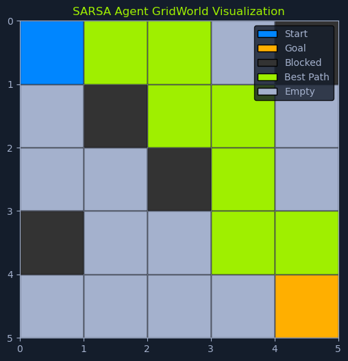
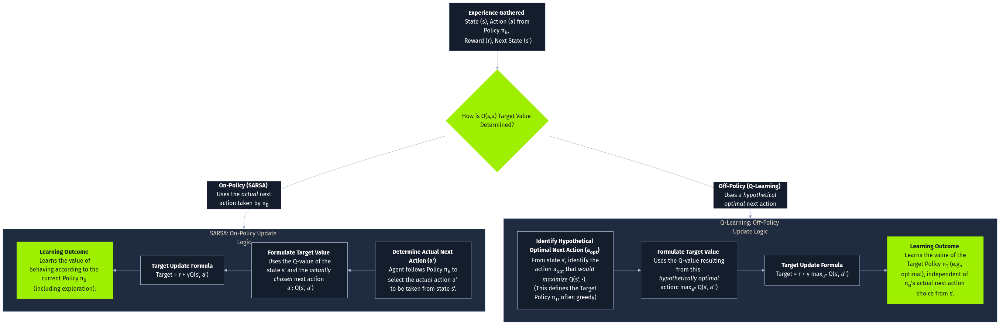

# SARSA (State-Action-Reward-State-Action)


*SARSA GridWorld: 5x5 grid with blue start at (0,0), orange goal at (4,4), black blocked cells at (1,2) and (3,2), green best path from start to goal*

## Overview

**SARSA** is a model-free reinforcement learning algorithm that learns an optimal policy through direct environmental interaction. The name SARSA is an acronym derived from the sequence of elements used in its update rule: **State-Action-Reward-State-Action**.

---

## SARSA vs Q-Learning: Key Difference

### Q-Learning (Off-Policy)
- Updates Q-values based on the **maximum Q-value** of the next state
- Learns the value of the **optimal policy**
- Independent of the current policy
- More exploratory and aggressive

### SARSA (On-Policy)
- Updates Q-values based on the Q-value of the next state and the **actual action taken** in that state
- Learns the value of the **policy it is currently following**
- Tied to the current policy
- More conservative and cautious

### Impact

This key difference makes:
- **SARSA**: An **on-policy** algorithm (learns value of current policy)
- **Q-learning**: An **off-policy** algorithm (learns value of optimal policy independent of current policy)

---

## SARSA Update Rule

The update rule for SARSA is:

```python
Q(s, a) <- Q(s, a) + α * (r + γ * Q(s', a') - Q(s, a))
```

### Components

**Where:**

- **s**: Current state
- **a**: Current action
- **r**: Reward received after taking action a
- **s'**: Next state (state reached after taking action a)
- **a'**: Next action taken (determined by current policy)
- **α**: Learning rate (controls update magnitude)
- **γ**: Discount factor (importance of future rewards)

### Key Component: Q(s', a')

The term **Q(s', a')** reflects the expected future reward for the next state-action pair, which the **current policy** determines.

**Critical difference from Q-learning:**
- **SARSA**: Uses `Q(s', a')` - the actual next action from the policy
- **Q-learning**: Uses `max Q(s', a')` - the best possible next action

---

## Behavioral Implications

### SARSA's Conservative Approach

This conservative approach makes SARSA suitable for environments where:
- **Safety is critical**: Policy needs to be followed closely
- **Stability is important**: Avoid risky exploratory actions
- **Current policy performance**: Matters more than finding absolute optimum

### Q-Learning's Exploratory Nature

Q-Learning's more exploratory nature:
- Can more efficiently find **optimal policies** in some cases
- More aggressive in exploration
- Better for environments where safety is less critical

---

## Robot Navigation Example

Imagine a **robot learning to navigate a room with obstacles**:

### SARSA's Approach

SARSA guides the robot to learn a **safe path** by considering:

1. **Immediate reward** of an action
2. **Consequences of the next action** taken in the new state

### Benefits

This cautious approach helps the robot:
- ✅ Avoid risky actions that might lead to collisions
- ✅ Even if those actions initially seem promising
- ✅ Learn a safe, reliable path
- ✅ Maintain stability throughout learning

### Real-World Application

**Scenario:** Robot navigating warehouse

- **SARSA**: Learns to take wider turns around obstacles, even if slightly longer
- **Q-Learning**: Might attempt tight turns for efficiency, risking collisions during learning

---

## The SARSA Algorithm

The SARSA algorithm follows these steps:

### Step 1: Initialization

**Purpose:** Set up the Q-table.

**Process:**
- Initialize the Q-table with arbitrary values (usually 0) for each state-action pair
- This table will store the estimated Q-values for actions in different states

**Common initialization strategies:**
- All zeros (most common)
- Small random values
- Optimistic initialization (encourage exploration)

---

### Step 2: Choose an Action

**Purpose:** Select an action to execute in the current state **s**.

**Process:**
- Selection is typically based on an exploration-exploitation strategy
- Common strategies:
  - **Epsilon-greedy**: Balance exploring new actions with exploiting known high-reward actions
  - **Softmax**: Probabilistic selection based on Q-values
  - **Boltzmann exploration**: Temperature-based selection

**Why Important:** Determines the trade-off between learning new information and using current knowledge.

---

### Step 3: Take Action and Observe

**Purpose:** Execute the action and gather feedback.

**Process:**
1. Execute the chosen action **a** in the environment
2. Observe the **next state s'**
3. Observe the **reward r** received

**Feedback gathered:**
- **Next state**: Where did the action take us?
- **Reward**: Was this action beneficial?

This step involves interacting with the environment and gathering feedback on the consequences of the action.

---

### Step 4: Choose Next Action

**Purpose:** Select the action for the next state based on current policy.

**Process:**
- In the next state **s'**, select the next action **a'**
- Based on the current policy (e.g., epsilon-greedy)
- Use the same exploration strategy as Step 2

### ⚠️ Critical Step for SARSA

This step is **crucial for SARSA's on-policy nature**:
- Considers the **actual action taken** in the next state
- NOT just the theoretically optimal action
- Reflects what the agent will actually do

**Contrast with Q-learning:**
- **SARSA**: Chooses a' using current policy → Updates based on a'
- **Q-learning**: Doesn't choose a' → Updates based on max over all actions

---

### Step 5: Update Q-value

**Purpose:** Learn from the experience.

**Process:** Update the Q-value for the state-action pair **(s, a)** using:

```python
Q(s, a) <- Q(s, a) + α * (r + γ * Q(s', a') - Q(s, a))
```

**What's happening:**
1. Calculate **temporal difference (TD) error**: `r + γ * Q(s', a') - Q(s, a)`
2. Scale by learning rate **α**
3. Add to current Q-value

**Interpretation:**
- **Positive TD error**: Action was better than expected → Increase Q-value
- **Negative TD error**: Action was worse than expected → Decrease Q-value

---

### Step 6: Update State and Action

**Purpose:** Move to the next state and action.

**Process:**
- Update the current state: **s = s'**
- Update the current action: **a = a'**

**Why Important:** 
- Prepares the algorithm for the next iteration
- Maintains continuity in the learning process
- The action a' is already chosen, so no need to select again in next iteration

---

### Step 7: Iteration

**Purpose:** Repeat the learning process.

**Process:** Repeat steps 2-6 until:
- Q-values **converge** (stop changing significantly)
- Maximum number of **iterations** is reached
- Performance **threshold** is met

**Result:** This iterative process allows the agent to learn and refine its policy continuously.

---

## On-Policy vs Off-Policy Learning


*Reinforcement Learning flowchart: On-policy learning updates based on current policy and includes exploratory actions. Off-policy learning is independent of current policy and can use data from different policies.*

In reinforcement learning, the learning process can be categorized into two main approaches: **on-policy** and **off-policy** learning. This distinction stems from how algorithms update their estimates of action values, which are crucial for determining the optimal policy.

---

## Definitions

### On-Policy Learning

**Definition:** The algorithm learns the value of its **current policy**.

**Characteristics:**
- Updates to estimated action values are based on actions taken while executing the **current policy**
- Includes any **exploratory actions**
- Learns "what I will do"

**Examples:**
- SARSA
- Expected SARSA
- Actor-Critic methods

---

### Off-Policy Learning

**Definition:** The algorithm learns about an **optimal policy** independently of the policy being followed for action selection.

**Characteristics:**
- Can learn from data generated by a **different policy**
- Benefits exploration and learning from **historical data**
- Learns "what is the best thing to do"

**Examples:**
- Q-learning
- Deep Q-Networks (DQN)
- Double DQN

---

## SARSA vs Q-Learning Comparison

_0.png)
*Flowchart: Start with state-action pair. Choose SARSA to follow current policy or Q-learning for greedy action. Both update Q-values. Implications: Q-learning learns optimal policy, SARSA focuses on current policy stability.*

### Update Rule Comparison

| Aspect | SARSA (On-Policy) | Q-Learning (Off-Policy) |
|--------|-------------------|-------------------------|
| **Update uses** | Next action a' from current policy | Max Q-value over all actions |
| **Formula** | `Q(s,a) + α[r + γQ(s',a') - Q(s,a)]` | `Q(s,a) + α[r + γ max Q(s',a') - Q(s,a)]` |
| **Learns** | Value of current policy | Value of optimal policy |
| **Exploration effect** | Exploratory actions affect learned values | Exploratory actions don't affect optimal values |
| **Behavior** | Conservative, safer | Aggressive, optimal |

---

## SARSA's On-Policy Nature Explained

SARSA's on-policy nature stems from its **unique update rule**:

### Key Mechanism

It uses the Q-value of:
- The **next state** (s')
- The **actual action taken** in that next state (a')
- According to the **current policy**

To update the Q-value of the current state-action pair.

### Contrast with Q-Learning

**Q-learning** uses:
- The **maximum Q-value** over all possible actions in the next state
- **Regardless** of the current policy

---

## Important Implications

### 1. Learning the Value of the Current Policy

**SARSA learns the value of its current policy**, including the exploration steps.

**Meaning:**
- Estimates the expected return for taking actions **according to the current policy**
- Current policy might involve **some exploratory moves**
- Learned Q-values reflect the actual behavior of the agent

**Example:**
- If using ε-greedy with ε=0.1
- SARSA learns values assuming 10% random actions
- Q-learning learns optimal values ignoring exploration

---

### 2. Safety and Stability

**On-policy learning** can be advantageous when safety and stability are critical.

**Why:**
- SARSA learns by **following the current policy**
- Less likely to explore potentially **dangerous or unstable actions**
- Avoids actions that could lead to **negative consequences**

**Use cases:**
- Robotics with physical constraints
- Medical treatment planning
- Financial trading (risk management)
- Autonomous vehicles (safety-critical)

---

### 3. Exploration Influence

The **exploration strategy** (e.g., epsilon-greedy) influences learning.

**Impact:**
- SARSA learns the policy's value **including exploration**
- Learned Q-values reflect the balance between **exploration and exploitation**
- More exploratory policy → More conservative Q-values

**Example:**
- High ε (0.3): SARSA learns to account for 30% random actions
- Low ε (0.05): SARSA learns more optimal values

---

## Summary of On-Policy Learning

In essence, SARSA learns **"on the job"**:

- Continuously updating its estimates based on:
  - Actions taken while **following its current policy**
  - Rewards received during this process

**Suitable for:**
- Scenarios where learning a **safe and stable policy** is a priority
- Even if it means potentially **sacrificing some optimality**

---

## Exploration-Exploitation Strategies in SARSA

Just like Q-learning, SARSA also faces the **exploration-exploitation dilemma**. The agent must balance:

- **Exploring** new actions to discover potentially better strategies
- **Exploiting** its current knowledge to maximize rewards

The choice of exploration-exploitation strategy influences the learning process and the resulting policy.

---

## Epsilon-Greedy Strategy

_2.png)
*SARSA Step: Epsilon-greedy action selection with probabilities ε for random action and 1-ε for greedy action. Observe next state and reward, repeat epsilon-greedy selection, update Q-value, end step.*

As discussed in Q-learning, the **epsilon-greedy strategy** involves:

### Mechanism

- Select a **random action** with probability **ε** (epsilon)
- Select the **greedy action** (highest Q-value) with probability **1-ε**

### Balance

This approach balances exploration and exploitation by:
- Occasionally choosing random actions
- Discovering potentially better options
- Mostly exploiting known good actions

---

### Epsilon-Greedy in SARSA: More Cautious

In SARSA, the epsilon-greedy strategy leads to **more cautious exploration**:

**Why:**
- The agent considers the **potential consequences** of exploratory actions in the next state
- Ensures exploratory actions do not deviate too far from known good policies
- Both current and next actions use epsilon-greedy

**Process in SARSA:**
1. Choose action **a** using ε-greedy in state s
2. Observe next state **s'** and reward **r**
3. Choose action **a'** using ε-greedy in state s'
4. Update Q(s, a) using Q(s', a')

**Result:** More stable, safer learning compared to Q-learning.

---

### Example Comparison

**Scenario:** Robot near cliff edge

**Q-Learning:**
- Might learn optimal path close to cliff
- Ignores exploration risk in update
- "Go close to cliff for shorter path"

**SARSA with ε-greedy:**
- Learns to avoid cliff during exploration
- Accounts for occasional random actions near edge
- "Stay away from cliff to be safe during exploration"

---

## Softmax Strategy

_3.png)
*SARSA Softmax Step: Start with Softmax action selection, compute action probabilities, select action, observe next state and reward, repeat Softmax selection, update Q-value, end step.*

The **softmax strategy** (also called Boltzmann exploration) assigns probabilities to actions based on their Q-values.

### Formula

```python
P(a|s) = e^(Q(s,a)/τ) / Σ_a' e^(Q(s,a')/τ)
```

Where:
- **τ (tau)**: Temperature parameter
- **e**: Euler's number
- **Σ**: Sum over all possible actions

---

### Characteristics

**Higher Q-values** → **Higher probabilities**

**Advantages:**
- Smoother exploration
- Actions with moderately high Q-values still have a chance
- More balanced approach to exploration and exploitation

### Temperature Parameter (τ)

**High τ (e.g., 10):**
- Nearly uniform probability distribution
- More exploration (all actions have similar probabilities)

**Low τ (e.g., 0.1):**
- Concentrated probability on highest Q-value
- More exploitation (best action highly favored)

**Typical decay:**
- Start with high τ for exploration
- Gradually decrease for exploitation

---

### Softmax in SARSA: Nuanced Behavior

In SARSA, the softmax strategy can lead to **more nuanced and adaptive behavior**:

**Benefits:**
- Encourages exploring actions that are **not necessarily the best** but are still **promising**
- Potentially leading to better **long-term outcomes**
- Smoother learning curves

**Why effective in SARSA:**
- Since SARSA learns the value of the current policy
- Softmax's probabilistic nature aligns well with on-policy learning
- Creates more stable policy improvements

---

## Strategy Selection Guidelines

The choice of exploration-exploitation strategy in SARSA depends on:

### Factors to Consider

1. **Problem nature**: Safety-critical vs performance-focused
2. **Environment type**: Deterministic vs stochastic
3. **Desired balance**: Safety vs optimality
4. **Learning speed**: Fast convergence vs thorough exploration

---

### Strategy Impact

| Strategy | Exploration | Learning Speed | Safety | Final Policy |
|----------|-------------|----------------|--------|--------------|
| **High ε (0.3)** | High | Slow | High | Suboptimal but safe |
| **Low ε (0.05)** | Low | Fast | Medium | Near-optimal |
| **Softmax (high τ)** | High | Medium | High | Balanced |
| **Softmax (low τ)** | Low | Fast | Medium | Near-optimal |

---

### Recommendations

**More exploratory strategy:**
- ✅ Longer learning process
- ✅ Potentially more optimal policy
- ⚠️ Takes more time to converge

**More conservative strategy:**
- ✅ Faster learning
- ✅ Safer during training
- ⚠️ Potentially suboptimal policy that avoids risky actions

---

## Convergence and Parameter Tuning

Like other iterative algorithms, SARSA requires **careful parameter tuning** to ensure convergence to an optimal policy.

### What is Convergence?

**Convergence in Reinforcement Learning** means:
- The algorithm reaches a **stable solution**
- Q-values **no longer change significantly** with further training
- Indicates the agent has learned a policy that effectively **maximizes rewards**

---

## Critical Parameters

Two crucial parameters that influence the learning process:

### 1. Learning Rate (α)

**Purpose:** Controls the extent of Q-value updates in each iteration.

**Range:** 0 < α ≤ 1

**Effects:**

**High α (e.g., 0.9):**
- ✅ Leads to faster updates
- ✅ Quick adaptation to new information
- ⚠️ Can cause instability
- ⚠️ Oscillations in Q-values
- ⚠️ May not converge

**Low α (e.g., 0.01):**
- ✅ Ensures more stable convergence
- ✅ Smooth learning curves
- ⚠️ Slows down learning
- ⚠️ Takes longer to adapt

**Typical values:** 0.1 - 0.5

**Decay strategy:**
- Start with higher α for fast initial learning
- Decrease over time for stable convergence
- Formula: `α = α₀ / (1 + decay_rate * episode)`

---

### 2. Discount Factor (γ)

**Purpose:** Determines the importance of future rewards relative to immediate rewards.

**Range:** 0 ≤ γ ≤ 1

**Effects:**

**High γ (close to 1, e.g., 0.99):**
- ✅ Emphasizes long-term rewards
- ✅ Agent plans ahead
- ✅ Considers distant consequences
- Use for: Long-horizon tasks (chess, Go)

**Low γ (e.g., 0.1):**
- ✅ Prioritizes immediate rewards
- ✅ Focuses on short-term gains
- ✅ Faster learning for simple tasks
- Use for: Short-term tasks, greedy strategies

**Typical values:** 0.9 - 0.99

**Interpretation:**
- γ = 0: Only immediate rewards matter
- γ = 1: All future rewards equally important (infinite horizon)
- γ = 0.9: Reward 10 steps ahead worth 0.9^10 ≈ 0.35 times current reward

---

## Parameter Tuning Approaches

### 1. Grid Search

**Method:** Systematically explore different parameter combinations.

**Process:**
```python
α_values = [0.01, 0.1, 0.3, 0.5]
γ_values = [0.8, 0.9, 0.95, 0.99]

for α in α_values:
    for γ in γ_values:
        # Train SARSA with these parameters
        # Evaluate performance
        # Keep track of best combination
```

**Advantages:**
- Comprehensive search
- Finds good combinations

**Disadvantages:**
- Computationally expensive
- Time-consuming

---

### 2. Random Search

**Method:** Randomly sample parameter combinations.

**Advantages:**
- Faster than grid search
- Good coverage of parameter space

---

### 3. Cross-Validation

**Method:** Test parameters on multiple environment instances or splits.

**Process:**
1. Divide data/episodes into folds
2. Train on some, validate on others
3. Average performance across folds

---

### 4. Adaptive Methods

**Method:** Automatically adjust parameters during learning.

**Examples:**
- **AdaGrad**: Adapts learning rate based on past gradients
- **Adam**: Combines momentum and adaptive learning rates
- **Epsilon decay**: Automatically reduce exploration over time

---

## Convergence Conditions

The convergence of SARSA depends on:

### 1. Exploration-Exploitation Strategy

**Requirement:** Ensures that all state-action pairs are visited **infinitely often** (in theory) or **sufficiently often** (in practice).

**Why:** Without visiting all state-action pairs, agent cannot learn their true values.

---

### 2. Learning Rate Decay

**Requirement:** Learning rate α should be sufficiently small or decrease over time.

**Robbins-Monro conditions:**
```
Σ α_t = ∞  (learn infinitely)
Σ α_t² < ∞  (converge to a point)
```

**Practical decay:**
```python
α_t = α₀ / (1 + t/T)
```

---

### 3. Environment Properties

**Requirements:**
- **Stationary**: Dynamics don't change over time
- **Ergodic**: All states reachable from any other state

---

## Convergence Guarantees

**SARSA is guaranteed to converge** to an optimal policy under certain conditions:

✅ **Learning rate** is sufficiently small
✅ **Exploration strategy** ensures all state-action pairs visited infinitely often
✅ **Environment** is stationary and ergodic
✅ **Reward function** is bounded

---

## Data Assumptions

SARSA makes similar assumptions to Q-learning:

### 1. Markov Property

**Assumption:** The environment satisfies the **Markov property**.

**Definition:** The next state depends only on:
- The **current state**
- The **current action**

**NOT on:**
- The history of previous states
- The sequence of actions taken

**Mathematical notation:**
```
P(s_{t+1} | s_t, a_t, s_{t-1}, a_{t-1}, ..., s_0, a_0) = P(s_{t+1} | s_t, a_t)
```

**Why It Matters:**
- Allows agent to make decisions based solely on current state
- Simplifies the learning problem
- Enables efficient value function representation

---

### 2. Stationary Environment

**Assumption:** The environment's dynamics do not change over time.

**What Stays Constant:**
- **Transition probabilities**: P(s' | s, a)
- **Reward functions**: R(s, a)

**Why It Matters:**
- Q-values learned in the past remain valid
- Agent doesn't need to forget and relearn
- Convergence guarantees hold

**Handling Non-Stationary Environments:**
- Use higher learning rate to adapt quickly
- Implement forgetting mechanisms
- Periodic retraining
- Track concept drift

---

## Advantages and Limitations

### ✅ Advantages

- **On-policy learning**: Learns safe, stable policies
- **Safety-focused**: Avoids risky actions during training
- **Straightforward**: Easy to implement and understand
- **Convergence guarantee**: Proven to converge under certain conditions
- **Flexible exploration**: Works with various exploration strategies
- **No maximization bias**: Unlike Q-learning, doesn't overestimate values
- **Realistic learning**: Learns actual behavior including exploration

### ⚠️ Limitations

- **Slower learning**: More conservative than Q-learning
- **Potentially suboptimal**: May not find true optimal policy
- **Discrete spaces**: Works best with discrete states/actions
- **Memory intensive**: Q-table grows with state-action space
- **Slower convergence**: Compared to off-policy methods
- **Requires full trajectory**: Needs to execute actions (no offline learning)
- **Assumes Markov property**: May not work well in non-Markovian environments

---

## SARSA vs Q-Learning: When to Use

### Use SARSA When:

✅ **Safety is critical**: Robotics, medical applications, autonomous vehicles
✅ **Learning during operation**: Agent learns while performing actual task
✅ **Risk-averse behavior**: Want to avoid dangerous states during training
✅ **On-policy evaluation**: Need to evaluate specific policy
✅ **Stable learning**: Prefer smooth, predictable learning curves

### Use Q-Learning When:

✅ **Optimality is priority**: Need best possible policy
✅ **Simulation available**: Can afford risky exploration in simulation
✅ **Off-policy learning**: Want to learn from different behavior policies
✅ **Faster convergence**: Need quicker learning
✅ **Historical data**: Can learn from previously collected data

---

## Practical Considerations

### Implementation Tips

1. **Start conservative**: Begin with low ε and high safety margins
2. **Monitor learning**: Track episode rewards and Q-value changes
3. **Tune gradually**: Adjust parameters incrementally
4. **Use decay schedules**: Reduce ε and α over time
5. **Validate safety**: Test in safe environments first

### Common Pitfalls

❌ **Too high learning rate**: Causes oscillations
❌ **Insufficient exploration**: Misses better policies
❌ **Too much exploration**: Slow convergence
❌ **Fixed parameters**: Not adapting over time
❌ **Ignoring safety**: Treating SARSA like Q-learning

---

## Extensions and Variants

### Expected SARSA

**Improvement:** Instead of using Q(s', a'), use expected value over all actions.

**Formula:**
```python
Q(s,a) <- Q(s,a) + α[r + γ * Σ π(a'|s') * Q(s',a') - Q(s,a)]
```

**Benefits:**
- Reduces variance
- More stable learning
- Still on-policy

---

### n-Step SARSA

**Improvement:** Update using n-step returns instead of 1-step.

**Benefits:**
- Better credit assignment
- Faster propagation of rewards
- Balance between TD and Monte Carlo

---

### SARSA(λ)

**Improvement:** Combines n-step returns using eligibility traces.

**Benefits:**
- Efficient credit assignment
- Bridges TD and Monte Carlo methods
- Parameter λ controls trade-off

---

## Summary

SARSA is a valuable reinforcement learning algorithm that offers an **on-policy learning approach**, making it suitable for scenarios where **safety and stability** are critical considerations.

### Core Concepts

**Algorithm type:**
- Model-free reinforcement learning
- On-policy temporal difference learning
- Named after State-Action-Reward-State-Action sequence

**Key characteristics:**
- Learns value of current policy (including exploration)
- More conservative and safer than Q-learning
- Updates based on actual next action taken

### Update Rule

```python
Q(s, a) <- Q(s, a) + α * (r + γ * Q(s', a') - Q(s, a))
```

**Critical component:** Uses actual next action a' from current policy

### Algorithm Steps

1. Initialize Q-table
2. Choose action using exploration strategy
3. Take action, observe next state and reward
4. Choose next action using exploration strategy
5. Update Q-value using actual next action
6. Update state and action
7. Repeat until convergence

### On-Policy Nature

**Meaning:**
- Learns while following current policy
- Updates reflect actual behavior
- Includes exploration in learned values

**Advantages:**
- Safer learning
- Stable policies
- Realistic behavior modeling

### Exploration Strategies

**Epsilon-greedy:**
- Simple and effective
- More cautious in SARSA than Q-learning
- Decay ε over time

**Softmax:**
- Probabilistic selection
- Smoother exploration
- Temperature parameter controls exploration

### Parameter Tuning

**Learning rate (α):**
- Controls update magnitude
- Typical: 0.1 - 0.5
- Decay for stable convergence

**Discount factor (γ):**
- Balances immediate vs future rewards
- Typical: 0.9 - 0.99
- Higher for long-term planning

### Convergence

**Guaranteed under:**
- Small learning rate (or appropriate decay)
- Sufficient exploration (all states visited)
- Stationary environment
- Bounded rewards

### Assumptions

**Markov property:**
- Next state depends only on current state and action

**Stationary environment:**
- Dynamics don't change over time

### Applications

**Ideal for:**
- Robot navigation with safety constraints
- Medical treatment planning
- Financial risk management
- Any domain where safety during learning is critical

**Best used when:**
- Safety is priority over pure optimality
- Learning occurs during actual operation
- Risk-averse behavior is desired

### Key Takeaway

SARSA's ability to **learn by following a specific policy** allows it to find effective solutions while **avoiding potentially harmful actions**. It trades some optimality for safety and stability, making it invaluable in real-world applications where the cost of mistakes during learning is high.
